# Progetto 1.1: Analisi comparativa tra OS161 e altri sistemi operativi open-source all'avanguardia per sistemi embedded e computer general purpose

Per questo progetto abbiamo scelto di analizzare _PintOS_, un sistema operativo didattico open source per l'architettura del set di istruzioni x86, attualmente in uso in diversi istituti. Fu creato all'università di Stanford da Ben Pfaff nel 2004 e originariamente pensato per sostituire il sistema operativo NachOS, un sistema simile creato dalla University of California a Berkeley. A differenza di NachOS, PintOS può essere eseguito sull'hardware x86 reale, sebbene venga spesso eseguito su un'emulatore di sistema, come Bochs o Qemu (noi abbiamo utilizzato QEMU).

Di seguito verranno esaminate nel dettaglio le sue caratteristiche e messe a confronto con il sistema operativo OS161, studiato durante il corso di Programmazione di Sistema.  

# Sezione I: Analisi comparativa di OS161 e Pintos #

## Architettura ##

_OS161_ è progettato come un sistema operativo monolitico, dove tutti i componenti chiave, come il kernel e i driver dei dispositivi, risiedono in uno spazio di indirizzamento comune.

_PintOS_ invece è progettato come un sistema operativo di tipo microkernel, dove il kernel è diviso in componenti più piccoli e indipendenti chiamati "thread utente". Ogni thread utente contiene le informazioni necessarie per l'esecuzione del processo, come il codice del programma, lo stato del processore e lo stato di I/O. I thread utente sono implementati come thread del kernel, il che semplifica la gestione dei processi.

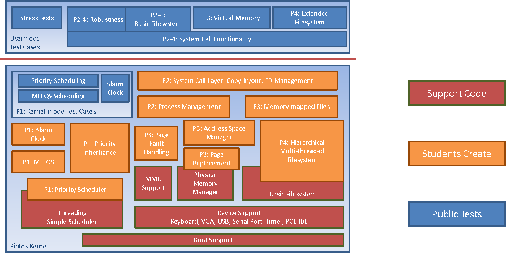


## System Calls ##

Le system calls (chiamate di sistema) sono funzioni fornite dal sistema operativo per consentire ai programmi di interagire con il kernel (il nucleo del sistema operativo) e sfruttare le risorse del sistema, come l'hardware, i file, la memoria. Queste sono fondamentali per il funzionamento dei sistemi operativi e svolgono un ruolo cruciale in vari aspetti:

1. **Gestione delle risorse**: Le system calls consentono ai programmi di richiedere l'allocazione e la liberazione di risorse hardware, come memoria, CPU e dispositivi di I/O. Ad esempio, una system call può essere utilizzata per richiedere memoria dinamica o per leggere da un file su disco.

2. **Protezione**: Le system calls impediscono ai programmi utente di accedere direttamente alle risorse hardware o di eseguire operazioni pericolose. Ciò garantisce maggior controllo su quali risorse vengono allocate o condivise tra i processi e previene l'accesso non autorizzato.

3. **Comunicazione tra processi**: Le system calls consentono la comunicazione tra i processi. Ad esempio, è possibile utilizzarle per creare processi figlio, condividere dati tra processi o sincronizzare l'esecuzione di processi diversi.

4. **Gestione dei file**: Molte system calls sono dedicate alla gestione dei file, come la creazione, l'apertura, la lettura, la scrittura e la chiusura dei file. Queste operazioni sono fondamentali per l'archiviazione e il recupero dei dati.

5. **Gestione delle interruzioni**: Le system calls consentono al kernel di gestire le interruzioni hardware e rispondere a eventi come la pressione di un tasto sulla tastiera o l'arrivo di dati in una porta di rete.

6. **Comunicazione di rete**: Le system calls sono spesso utilizzate per la comunicazione di rete, consentendo ai programmi di inviare e ricevere dati su una rete, come Internet.

_Os161_ e _Pintos_, sono sistemi operativi progettati per scopi didattici, per cui in entrambi nativamente manca il supporto completo delle system calls, come si può vedere di seguito:

* `kern/arch/mips/syscall/syscall.c` in _OS161_

```c
 void syscall(struct trapframe *tf) {
	int callno;
	int32_t retval;
	int err;
    ...

	callno = tf->tf_v0;
	retval = 0;

	switch (callno) {
	    case SYS_reboot:
		err = sys_reboot(tf->tf_a0);
		break;

	    case SYS___time:
		err = sys___time((userptr_t)tf->tf_a0,
				 (userptr_t)tf->tf_a1);
		break;

	    /* Add stuff here */

	    default:
		kprintf("Unknown syscall %d\n", callno);
		err = ENOSYS;
		break;
	}
    ...
 ```

 * `src/userprog/syscall.c` in _Pintos_

 ```c
#include "userprog/syscall.h"
#include <stdio.h>
#include <syscall-nr.h>
#include "threads/interrupt.h"
#include "threads/thread.h"

static void syscall_handler (struct intr_frame *);

void syscall_init (void) {
  intr_register_int (0x30, 3, INTR_ON, syscall_handler, "syscall");
}

static void syscall_handler (struct intr_frame *f UNUSED) {
  printf ("system call!\n");
  thread_exit ();
}
 ```
 Vedremo l'implementazione di alcune system calls in _Pintos_ nella **sezione II** del progetto.

## Scheduling ##

### Politiche di Scheduling ###

Le politiche di scheduling di _OS161_ e _PintOS_ risultano simili, essendo sistemi operativi didattici, utilizzati spesso in corsi universitari per insegnare i principi dei sistemi operativi.

Entrambi utilizzano una politica di scheduling semplice e predefinita basata sull'approccio Round Robin (RR), dove i processi vengono assegnati in base al loro ordine di arrivo. 
Tuttavia, sia in _OS161_ che in _Pintos_, è possibile implementare, come estensione del sistema operativo, politiche di scheduling più avanzate come il Multi-Level Feedback Queue (MLFQ), il Dynamic Priority Scheduling o l'Inverse Priority Scheduling. 

### Implementazione ###

Sia OS161 che Pintos implementano l'algoritmo Round Robin, in cui i processi vengono schedulati in modo circolare. Ogni processo riceve un quantum di tempo assegnato (in _Pintos_ `#define TIME_SLICE 4`) e, quando il quantum scade, il processo viene messo in coda e viene eseguito il successivo processo pronto. Questo ciclo di esecuzione continua finchè ci sono processi nella coda pronti ad essere eseguiti.

In _Pintos_ ad ogni interrupt del timer, la variabile globale `ticks` (numero di tic del timer dall'avvio di Pintos) viene incrementata di uno.

`src/devices/timer.c`
```c
/* Timer interrupt handler. */
static void timer_interrupt (struct intr_frame *args UNUSED){
  ticks++;
  thread_tick ();
}
```

`src/threads/thread.c`
```c
void thread_tick (void){
  struct thread *t = thread_current ();

  /* Update statistics. */
  if (t == idle_thread)
    idle_ticks++;
#ifdef USERPROG
  else if (t->pagedir != NULL)
    user_ticks++;
#endif
  else
    kernel_ticks++;

  /* Enforce preemption. */
  if (++thread_ticks >= TIME_SLICE)
    intr_yield_on_return ();
}
```
Quando un thread esaurisce la sua fetta temporale, `thread_tick` chiama la funzione `intr_yield_on_return`, che modifica un flag per informare l'handler che, prima di tornare dall'interrupt, dovrebbe effettuare uno switch di contesto ad un thread diverso.

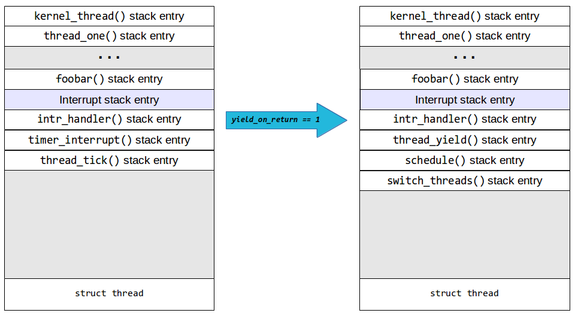

A questo punto l'interrupt handler chiamerà la `thread_yield`, la funzione responsabile di cedere volontariamente la CPU allo scheduler e consentire al successivo thread pronto di essere eseguito.

```c
void thread_yield (void) {

  /* Puntatore al thread corrente */
  struct thread *cur = thread_current ();
  enum intr_level old_level;

  /* Si verifica che la funzione non sia chiamata da un gestore di interrupt */
  ASSERT (!intr_context ());

  old_level = intr_disable ();
  if (cur != idle_thread)
    list_push_back (&ready_list, &cur->elem);
  cur->status = THREAD_READY;
  schedule ();
  intr_set_level (old_level);
}
```
Inizialmente, se il thread corrente non è l'`idle_thread` (il thread inattivo), viene inserito nella coda dei thread pronti (`ready_list`) utilizzando la `list_push_back()` e viene impostato lo stato a `THREAD_READY`, indicando che il thread corrente è pronto per l'esecuzione. Viene chiamata poi la funzione `schedule()`, che è responsabile di decidere quale thread eseguire successivamente. 
Alla fine viene ripristinato il livello di interrupt alla priorità iniziale, prima della chiamata a `thread_yield`.

```c
static void schedule (void) {
  struct thread *cur = running_thread ();
  struct thread *next = next_thread_to_run ();
  struct thread *prev = NULL;

  /* Asserzioni per verificare che le interruzioni siano disabilitate e 
  che il thread corrente non sia più in uno stato di esecuzione. */
  ASSERT (intr_get_level () == INTR_OFF);
  ASSERT (cur->status != THREAD_RUNNING);
  ASSERT (is_thread (next));

  if (cur != next)
    prev = switch_threads (cur, next);
  thread_schedule_tail (prev);
}
```
La funzione `schedule()`, nel dettaglio, svolge un ruolo essenziale: ottiene un riferimento al thread corrente con `running_thread()` e un riferimento al successivo thread da eseguire con `next_thread_to_run()`. Il `next_thread_to_run` è selezionato dallo scheduler e rappresenta il successivo thread nella coda dei thread pronti (`ready_list`). Se il thread corrente (`cur`) è diverso dal successivo thread da eseguire (`next`), la funzione chiama `switch_threads` per effettuare una commutazione di contesto tra i due thread, ossia restituisce un riferimento al thread che stava precedentemente in esecuzione. Questa operazione comporta la modifica dei registri della CPU in modo che il successivo thread possa essere eseguito. La funzione `schedule` richiama poi `thread_schedule_tail` per completare il processo di scheduling e assicurarsi che il successivo thread sia in esecuzione. La variabile `prev` è utilizzata per tracciare il thread precedentemente in esecuzione, se è stato commutato.

In OS161, il meccanismo del Round Robin viene gestito tramite la funzione `hardclock()`, in `kern/thread/clock.c`, che viene periodicamente chiamata dal gestore delle interruzioni del clock hardware. All'interno di questa funzione possono essere chiamate altre 2 funzioni definite in `kern/thread/thread.c`:

- `thread_consider_migration()` per abilitare la migrazione dei thread tra i core della CPU;
- `schedule()` per cambiare l'ordine dei thread nella coda dei processi pronti (ma nativamente non compie alcuna azione).

Successivamente, come in Pintos, viene chiamata la funzione `thread_yield()` per far sì che il thread corrente ceda la CPU ad un altro thread tramite la `thread_switch()`.

```c
#define SCHEDULE_HARDCLOCKS	4	/* Reschedule every 4 hardclocks. */
#define MIGRATE_HARDCLOCKS	16	/* Migrate every 16 hardclocks. */

/* This is called HZ times a second (on each processor) by the timer code */
void hardclock(void) {

	curcpu->c_hardclocks++;
	if ((curcpu->c_hardclocks % MIGRATE_HARDCLOCKS) == 0) {
		thread_consider_migration();
	}
	if ((curcpu->c_hardclocks % SCHEDULE_HARDCLOCKS) == 0) {
		schedule();
	}
	thread_yield();
}
```
```c
void schedule(void) {
	/* You can write this. If we do nothing, 
  threads will run in round-robin fashion. */
}
```

```c
/* Yield the cpu to another process, but stay runnable. */
void thread_yield(void) {

	thread_switch(S_READY, NULL, NULL);
}
```

### Gestione delle priorità ###

Nella versione base, per entrambi i sistemi, non esiste il concetto di priorità: tutti i thread sono trattati allo stesso modo. Ciò significa che un processo continuerà ad essere eseguito finché non avrà terminato la sua esecuzione, indipendentemente dai requisiti di CPU di altri processi.

### Conclusioni ###

In conclusione, _OS161_ e _Pintos_, sono entrambi sistemi operativi utilizzati per scopi didattici, tuttavia il primo è più orientato all'apprendimento dei concetti dei sistemi operativi con un'implementazione semplice, il secondo fornisce una base più operativa per gli studenti, poichè mira ad essere un sistema operativo di base in grado di eseguire applicazioni reali.
Entrambi gli ambienti sono validi per l'apprendimento dei principi di scheduling, ma il loro focus differisce leggermente in base agli obiettivi educativi.

## Gestione della memoria ##

### Paging e virtual memory ###

Pintos implementa una gestione della memoria virtuale base, che include la paginazione e la gestione dello spazio degli indirizzi dei processi, consentendo ai processi di operare in spazi di indirizzamento separati e protetti. 

In particolare, la memoria fisica di _Pintos_ è suddivisa in pagine di dimensioni fisse, ognuna con un numero di pagina univoco. Ogni processo ha un proprio spazio di indirizzamento virtuale, suddiviso in pagine. La mappatura tra gli indirizzi virtuali dei processi e gli indirizzi fisici delle pagine è gestita da una tabella (Page Table) specifica per ciascun processo. Esso fa uso di strutture dati quali vettori, liste, bitmap, ma principalmente _Pintos_ include una struttura di tipo BitMap per tenere traccia dell'utilizzo in un insieme di risorse (identiche). Inoltre, viene utilizzata anche una struttura di tipo Hash Table che, in maniera efficiente supporta gli inserimenti ed eliminazioni su un'ampia gamma di tabelle. 

Per quanto riguarda la frame table, quella di _Pintos_ contiene un'entry per ogni frame che contiene una pagina utente. Ogni entry nella frame table contiene un puntatore alla pagina, se presente, che la occupa attualmente, più altri dati a nostra scelta. La frame table consente a Pintos di implementare in modo efficiente una politica di eliminazione, scegliendo una pagina da eliminare quando non ci sono frame liberi. 

Sia _Pintos_ che _OS161_, gestiscono la frame table in maniera analoga, e soprattutto possiedono un processo di liberazione del frame similare. Quindi occorre:
1) Scegliere un frame da eliminare, utilizzando l'algoritmo di sostituzione della pagina (sono da tenere in considerazione anche dirty bit e accessed bit durante la scelta del frame).
2) Rimuovere i riferimenti al frame da qualsiasi tabella delle pagine che fa riferimento ad esso.
3) Se necessario, scrivere la pagina nel file system o scambiarla.

_Pintos_ possiede anche una "supplemental page table" per integrare dati addizionali per ogni pagina, e il suo utilizzatore più importante è il "page fault handler". Viene usata principalmente per due motivi:

1) Durante un page fault, il kernel cerca la pagina virtuale che ha causato l'errore nella tabella delle "supplemental page table" per scoprire quali dati dovrebbero essere presenti.
2) Il kernel consulta la "supplemental page table" quando un processo termina, per decidere quali risorse liberare.

Per questi motivi _Pintos_ possiede un sistema di paginazione e memoria virtuale simile a quello presente su OS161, mentre la sostanziale differenza risiede nel livello di complessità con cui sono state implementate queste funzioni.

## Meccanismi di sincronizzazione ##

### Introduzione ###

I **meccanismi di sincronizzazione** sono strumenti che consentono a più processi o thread di condividere le risorse in modo sicuro e affidabile.
Una risorsa condivisa è una risorsa che può essere utilizzata da più processi o thread contemporaneamente e può essere: una variabile condivisa, un dispositivo hardware o un buffer di memoria.

Se l'accesso concorrente alle risorse condivise non viene gestito opportunamente si può incorrere nei seguenti problemi:

•	**Race condition**: due o più processi o thread cercano di accedere contemporaneamente alla stessa risorsa condivisa senza sincronizzazione adeguata. Questo può portare a risultati imprevedibili o errati poiché l'ordine di esecuzione delle istruzioni non è garantito;

•	**Deadlock**: due o più processi o thread si bloccano reciprocamente, ciascuno aspettando che una risorsa venga rilasciata dall'altro;

•	**Starvation**: un processo o thread viene costantemente escluso dall'accesso a una risorsa condivisa da altri processi o thread che la utilizzano in modo esclusivo.

I meccanismi di sincronizzazione consentono di evitare questi problemi, garantendo che l'accesso alle risorse condivise sia eseguito in modo sicuro e affidabile.

### Disabilitazione degli interrupt ###

La disabilitazione degli interrupt è una pratica comune nei sistemi operativi per garantire la coerenza e la correttezza delle operazioni eseguite dai thread del kernel, specialmente in contesti critici, come la gestione di interruzioni esterne o la sincronizzazione tra i thread stessi.

**_Pintos_** è progettato come un **kernel preemptible**, il che significa che i thread del kernel possono essere interrotti in qualsiasi momento. 

La disabilitazione degli interrupt viene utilizzata per impedire la prelazione automatica dei thread da parte del timer o di altri interrupt, garantendo che il thread in esecuzione abbia la precedenza. Tuttavia, in Pintos si cerca di limitarne l'uso per evitare perdite di informazioni importanti, come i clock del timer o gli eventi di input. È fortemente suggerita la sincronizzazione esplicita utilizzando le primitive di sincronizzazione offerte dal sistema (_`thread/interrupt.h`_).

In **OS161**, la disabilitazione degli interrupt è gestita attraverso le funzioni `spl0()`, `splhigh()`, e `splx(s)` ( _`kern/include/spl.h`_ ). Queste funzioni consentono di gestire le priorità degli interrupt, bloccando quelli meno urgenti durante l'esecuzione di sezioni critiche. 

In entrambi i sistemi operativi Pintos e OS161, la disabilitazione degli interrupt è una pratica delicata che richiede attenzione. La scelta specifica di come gestire gli interrupt dipende dalle esigenze del sistema e dalla progettazione del kernel. 
In generale, si tende a preferire l'utilizzo di pratiche di sincronizzazione esplicite e di limitare al minimo indispensabile la disabilitazione degli interrupt, al fine di garantire la stabilità e le prestazioni ottimali del sistema operativo.

### Semafori ###

I **semafori** sono strumenti di sincronizzazione utilizzati per coordinare l'accesso concorrente alle risorse condivise tra i thread o i processi.

Le operazioni fondamentali sui semafori nei sistemi operativi sono `down` (o `P`) e `up` (o `V`). 
L'operazione `down` acquisisce un lock associato al semaforo, verifica il valore del semaforo, e se è maggiore di zero, lo decrementa di uno. Se il valore è zero, il thread viene bloccato o messo in attesa. Successivamente, viene rilasciato il lock.
L'operazione `up` acquisisce il lock associato al semaforo, incrementa il valore del semaforo di uno, sveglia un thread in attesa (se presente), e infine rilascia il lock.
Queste operazioni sono essenziali per garantire la sincronizzazione nell'accesso concorrente alle risorse condivise nei sistemi operativi.
Le funzioni equivalenti sono `sema_down` e `sema_up` in Pintos, e `P` e `V` in OS161.

In **Pintos**, i semafori sono rappresentati da una struttura dati che include un valore non negativo e un'implementazione di operazioni atomiche di "down" e "up". La libreria gestisce internamente l'elenco dei thread in attesa utilizzando una linked list. L'uso di "down" e "up" consente di creare una sincronizzazione tra i thread.
Il codice fornisce operazioni come `sema_init`, `sema_down`, `sema_try_down`, e `sema_up`.
La `sema_down` blocca il thread se il valore è zero, mentre `sema_try_down` prova ad abbassare il semaforo senza attendere e restituisce true se ha successo. La `sema_up` incrementa il valore del semaforo e sveglia un thread in attesa, se presente.

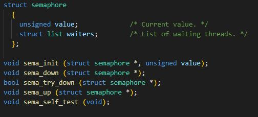

In **OS161**, i semafori sono implementati come una struttura dati contenente un nome, un canale di attesa (`wchan`), un lock spin e un contatore. Le operazioni `P` e `V` sono equivalenti alle operazioni "down" e "up". La funzione `P` decrementa il contatore e blocca il thread se è già zero, mentre la `V` incrementa il contatore e sveglia un thread in attesa.

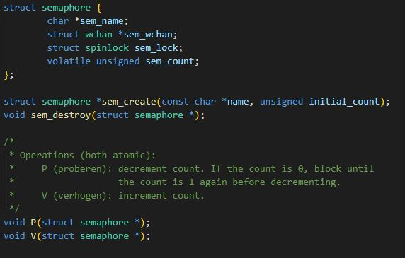

Entrambe le implementazioni seguono il modello classico di semafori di Dijkstra, con operazioni atomiche di "down" e "up" per garantire la sincronizzazione.
Tuttavia, ci sono alcune differenze nelle implementazioni specifiche.

Pintos:

- Utilizza una struttura di semaforo con una linked list per i thread in attesa.

- Fornisce una versione "try" di "down" per evitare l'attesa in un ciclo stretto.

OS161:

- Utilizza una struttura di semaforo con un canale di attesa (`wchan`) e un lock spin.


L'approccio di Pintos è più semplice da implementare, ma può essere meno efficiente se ci sono molti thread in attesa su un semaforo. L'approccio di OS161 è più efficiente, ma può essere più difficile da implementare.

### Lock (MUTEX) ###

Un **lock** è analogo a un semaforo con un valore iniziale di 1, equivalente al verde di un semaforo. L'azione "up" di un lock è chiamata "rilascio", mentre l'azione "down" è detta "acquisizione".

A differenza di un semaforo, un lock ha una restrizione: solo il thread che acquisisce il lock, il "proprietario", può rilasciarlo. 
_Se questa restrizione fosse problematica, l'utilizzo di un semaforo potrebbe essere preferibile._

In **Pintos** si ha un unico tipo di lock con le seguenti operazioni di base:
- `lock_init`: Inizializza un nuovo lock.
- `lock_acquire`: Acquisisce il lock, aspettando, se necessario, il suo rilascio.
- `lock_try_acquire`: Prova ad acquisire il lock senza attendere.
- `lock_release`: Rilascia il lock detenuto dal thread corrente.
- `lock_held_by_current_thread`: Verifica se il thread in esecuzione possiede il lock.

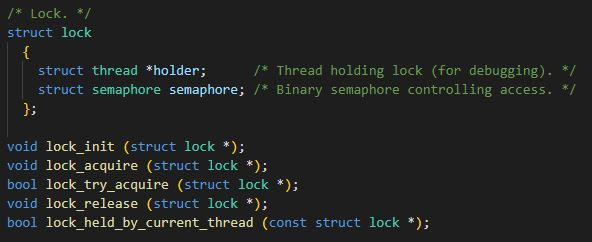


In **OS161**, il lock contiene un campo per il nome del lock e un _hook_ per il rilevamento dei deadlock (`lk_hangman`). 
Le operazioni di base sono:
- `lock_create`: Crea un nuovo lock.
- `lock_destroy`: Distrugge un lock.
- `lock_acquire`: Acquisisce il lock, garantendo la mutua esclusione.
- `lock_release`: Rilascia il lock detenuto dal thread corrente.
- `lock_do_i_hold`: Verifica se il thread corrente possiede il lock.

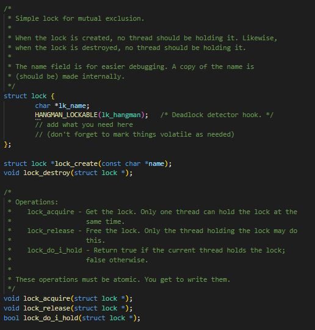


OS161 introduce anche gli **spinlock**, un meccanismo più primitivo in cui il lock è posseduto da una CPU anziché da un thread. 
Gli spinlock sono lock che non inducono il thread in attesa passiva, bensì il thread in attesa continua a eseguire un ciclo finché il lock non è disponibile. 
Gli spinlock sono preferiti in situazioni con attese brevi, ma devono essere usati con attenzione in attese prolungate, poiché comportano un consumo continuo delle risorse della CPU.

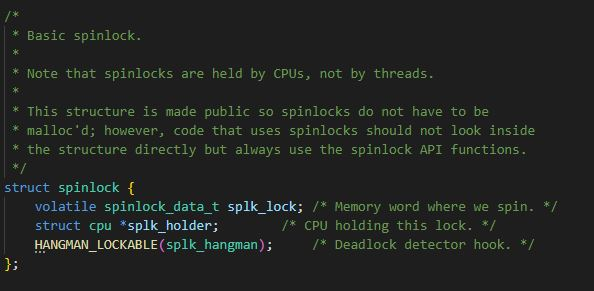
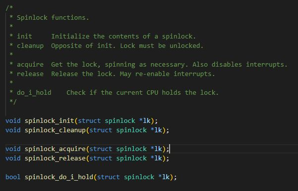

### Condition variables ### 

Le **condition variables** sono un meccanismo di sincronizzazione utilizzato nei sistemi operativi per la gestione di thread concorrenti. Esse forniscono un modo per far sì che un thread possa attendere fino a quando una certa condizione diventa vera, consentendo così una cooperazione efficiente tra i thread.

In **Pintos** le condition variables sono definite come una `struct codition`. 

Le funzioni principali includono `cond_init` per inizializzare una variabile di condizione, `cond_wait` per rilasciare il blocco del monitor e attendere una condizione, `cond_signal` per risvegliare un thread in attesa, e `cond_broadcast` per risvegliare tutti i thread in attesa.

In **OS161** le condition variables sono implementate attraverso la struttura `cv`. 

Le operazioni principali sono `cv_wait`, che rilascia il lock e va in sleep, `cv_signal`, che risveglia uno specifico thread in attesa, e `cv_broadcast`, che risveglia tutti i thread in attesa. 
Le operazioni devono essere eseguite atomicamente, e il thread corrente deve possedere il lock associato alla condition variable durante l'esecuzione di tali operazioni.

In entrambi i sistemi operativi, l'obiettivo delle condition variables è consentire ai thread di aspettare che determinate condizioni diventino vere, migliorando l'efficienza della sincronizzazione. 

_In **Pintos** si fa anche riferimento al concetto di "monitor" come una forma avanzata di sincronizzazione rispetto a semafori o lock. Un monitor è costituito da dati da sincronizzare, un lock detto **monitor lock** e variabili di condizione._


# Sezione II #

## INSTALLAZIONE SISTEMA OPERATIVO ##

Per settare Pintos è stata configurata una macchina virtuale con il sistema operativo Ubuntu a 32 bit. È stato poi scaricato il codice sorgente di Pintos dal sito ufficiale di Stanford (estratto tramite `tar -xzvf pintos.tar.gz`) e scaricato l'emulatore Qemu tramite `sudo apt-get install qemu`. 
Occorreva indirizzare Qemu verso Pintos in modo da poter runnare il codice con esso. Per questo è stato settato il simulatore Qemu in `src/threads/Make.vars` tramite `SIMULATOR = --qemu`.

**Aggiornamento della variabile di ambiente PATH:**
è stata aggiunta la riga `export PATH=$PINTOSHOME/src/utils:$PATH` in `HOME/.bashrc` e riavviato il terminale con il comando `source ~/.bashrc`.

**GDBMACROS:** per poter usare gdb è stata cambiata in `src/utils/pintos-gdb` la definizione di GDBMACROS puntando alla directory in cui è installato gdb-macros.
```bash
GDBMACROS = $PINTOSHOME/src/misc/gdb-macros
```
**Compilazione delle Utilities:** in `src/utils/Makefile` è stato sostituito `LDFLAGS = -lm` con `LDLIBS = -lm`. Successivamente viene compilata la directory utils:
```bash
cd pintos/src/utils
make
```

Variabili d'ambiente:
```bash
$HOME: /home/francy

$PINTOSHOME: $HOME/pintos/os/PintOS/src/pintos/
```

## Implementazione di nuove funzionalità ##

Come detto precedentemente, _Pintos_ è stato progettato principalmente per scopi didattici e per aiutare gli studenti a comprendere i concetti chiave dei sistemi operativi. Per questo progetto abbiamo scelto di focalizzarci sull'implementazione di alcune system calls poichè in Pintos non sono gestite per semplicità.

In `src/lib/user/syscall.c` è presente un insieme di macro e funzioni che semplificano la chiamata alle system calls in _Pintos_, rendendo più agevole il passaggio degli argomenti necessari e la gestione dei risultati restituiti dalle system calls. 

Le macro `syscall0`, `syscall1`, `syscall2`, e `syscall3` sono definite per le system calls con 0, 1, 2 o 3 argomenti. Ogni macro accetta il numero di system call (`NUMBER`) come primo argomento, seguito da eventuali argomenti necessari per la specifica chiamata di sistema. Queste macro generano il codice assembly necessario per effettuare la chiamata di sistema, passando il numero di sistema e gli argomenti all'interrupt handler (`int $0x30`) e restituendo il valore di ritorno della chiamata di sistema. Ci sono funzioni wrapper definite, come `halt`, `exit`, `exec`, `wait`, `create`, `remove`, ecc., che utilizzano queste macro per effettuare le chiamate di sistema. Queste funzioni semplificano ulteriormente l'utilizzo delle system calls, in quanto gli sviluppatori possono utilizzarle come interfacce più familiari.

```c
#define syscall0(NUMBER)                                        \
        ({                                                      \
          int retval;                                           \
          asm volatile                                          \
            ("pushl %[number]; int $0x30; addl $4, %%esp"       \
               : "=a" (retval)                                  \
               : [number] "i" (NUMBER)                          \
               : "memory");                                     \
          retval;                                               \
        })

void halt (void) {
  syscall0 (SYS_HALT);
  NOT_REACHED ();
}
```
Ad esempio, quando si chiama la `halt()`, il sistema eseguirà la chiamata di sistema corrispondente a `SYS_HALT` definendo il numero di sistema appropriato e passando gli argomenti necessari. 

Le system calls definite nativamente in Pintos in `src/lib/syscall-nr.h` sono:

 ```c
/* System call numbers. */
enum 
  {
    SYS_HALT,                   /* Halt the operating system. */
    SYS_EXIT,                   /* Terminate this process. */
    SYS_EXEC,                   /* Start another process. */
    SYS_WAIT,                   /* Wait for a child process to die. */
    SYS_CREATE,                 /* Create a file. */
    SYS_REMOVE,                 /* Delete a file. */
    SYS_OPEN,                   /* Open a file. */
    SYS_FILESIZE,               /* Obtain a file's size. */
    SYS_READ,                   /* Read from a file. */
    SYS_WRITE,                  /* Write to a file. */
    SYS_SEEK,                   /* Change position in a file. */
    SYS_TELL,                   /* Report current position in a file. */
    SYS_CLOSE,                  /* Close a file. */

    SYS_MMAP,                   /* Map a file into memory. */
    SYS_MUNMAP,                 /* Remove a memory mapping. */

    SYS_CHDIR,                  /* Change the current directory. */
    SYS_MKDIR,                  /* Create a directory. */
    SYS_READDIR,                /* Reads a directory entry. */
    SYS_ISDIR,                  /* Tests if a fd represents a directory. */
    SYS_INUMBER                 /* Returns the inode number for a fd. */
  };
 ```
Noi abbiamo scelto di implementare:
+ SYS_HALT
+ SYS_EXIT
+ SYS_WRITE
+ SYS_OPEN
+ SYS_CLOSE
+ SYS_CREATE
+ SYS_READ
+ SYS_FILESIZE

Le implementazioni sono state aggiunte in `src/userprog/syscall.c` e gestite nella `syscall_handler` tramite uno switch-case in base al numero di syscall.  

```c
void syscall_init (void) {
  //Interrupt handler
  intr_register_int (0x30, 3, INTR_ON, syscall_handler, "syscall");
}

static void syscall_handler (struct intr_frame *f) {

  int *ptr = f->esp;

  int syscall_number = *ptr;

  switch (syscall_number) {

    case SYS_HALT:
      /* ... */
      break;
    
    case SYS_EXIT:
      /* ... */
      break;

    /* ... */

    default:
      // Numero System Call non valido    
      break;
  }
}
```

La funzione `syscall_handler` si occupa essenzialmente della gestione delle chiamate di sistema e di estrarre i parametri dalle posizioni corrette nello stack e quindi decidere quale system call eseguire in base al numero di sistema passato come primo parametro. Questa funzione riceve come parametro `f`, un puntatore ad una `struct intr_frame`, che contiene informazioni sullo stato del thread quando si verifica un'interrupt o una system call. 

Il parametro `f->esp` rappresenta l'indirizzo nello stack del thread corrente in cui è memorizzato l'argomento per la system call, ovvero il numero che identifica la chiamata di sistema e gli eventuali parametri passati a tale chiamata.

In _Pintos_, quando si chiama una system call, è necessario collocare gli argomenti nello stack frame in posizioni specifiche. Ciò accade perchè c'è una discrepanza nello stack frame nella disposizione degli argomenti, in quanto è diversa in base al numero di argomenti passati alla chiamata di sistema. In particolare:

1. **Chiamate di sistema con 1 argomento**: l'argomento viene collocato nello stack frame del thread in esecuzione a `esp + 1`.

2. **Chiamata di sistema con 2 argomenti**: gli argomenti vengono collocati nello stack frame a `esp + 4` e `esp + 5`. Quindi, il primo argomento sarà a `esp + 4` e il secondo argomento a `esp + 5`.

3. **Chiamata di sistema con 3 argomenti**: gli argomenti saranno posizionati a `esp + 5`, `esp + 6` e `esp + 7`. In questo caso, il primo argomento sarà a `esp + 5`, il secondo a `esp + 6` e il terzo a `esp + 7`.

Questa convenzione semplifica la gestione degli argomenti per le diverse chiamate di sistema, garantendo che il kernel di Pintos possa accedere agli argomenti in modo coerente, indipendentemente dal numero di argomenti passati. 

In ogni `case` relativo ad una system call, abbiamo verificato con una funzione `check` la validità di un indirizzo utente (user address), eseguendo 2 controlli:

1. `is_user_vaddr` (già esistente in `src/threads/vaddr.h`) verifica che l'indirizzo utente sia inferiore a `PHYS_BASE`, che rappresenta il limite superiore degli indirizzi fisici a cui un processo utente può accedere. L'obiettivo di questo controllo è assicurarsi che l'indirizzo utente sia nella porzione valida dello spazio di indirizzamento. 

2. `pagedir_get_page` (già esistente in `src/userprog/pagedir.c`) verifica che l'indirizzo utente sia mappato nel page directory del thread corrente. In _Pintos_, ogni thread ha un page directory che contiene le mappe tra gli indirizzi virtuali degli utenti e gli indirizzi fisici corrispondenti. Il controllo `pagedir_get_page` restituisce l'indirizzo virtuale del kernel corrispondente a quell'indirizzo fisico, oppure un puntatore nullo se non è mappato.

La funzione `check` restituisce `true` se l'indirizzo utente passato come argomento è valido, oppure `false` in caso contrario. Ciò è utile per previene l'accesso a indirizzi di memoria non validi o non autorizzati da parte dei processi utenti.

```c
// Funzione per verificare se l'indirizzo è valido
bool check(void *addr) {

    if (is_user_vaddr(addr) == true &&
        pagedir_get_page(thread_current()->pagedir, addr)!=NULL)
        return true;
    else
        return false;
}
```

## SYSTEM CALLS IMPLEMENTATE ##

### SYS_HALT ###

La syscall HALT è utilizzata per terminare l'esecuzione del sistema operativo e spegnere il computer o la macchina virtuale in cui il sistema operativo è in esecuzione. In sostanza, viene utilizzata per spegnere il sistema in modo controllato e si implementa richiamando semplicemente la `shutdown_power_off()`, funzione già esistente in _Pintos_. 

```c
void halt (void){
  shutdown_power_off();
}
```

### SYS_EXIT ###

La system call EXIT è una chiamata di sistema utilizzata per terminare un processo in un sistema operativo. Quando un programma chiama la funzione `exit`, il processo corrente viene terminato e le risorse associate ad esso, come la memoria, i file aperti e altre risorse di sistema, vengono rilasciate. Prima di terminare il processo viene di solito restituito un valore di uscita al chiamante, che può essere recuperato dal processo padre o dal sistema operativo e utilizzato per valutare lo stato di terminazione del processo.

```c
void exit (int status){

    /* Per gestire il processo di terminazione di un thread,
    devo memorizzare il valore di uscita, notificare il processo genitore (se in attesa),
    e terminare il thread corrente */

    /* Memorizzo il valore di uscita del thread che può essere recuperato dal processo genitore.*/
    struct thread *cur = thread_current ();
    cur->exit_code = status;
    printf("%s: exit(%d)\n", cur->name, status);

    struct thread *parent_thread = cur->parent;
    struct child *children = get_child(cur->tid,parent_thread);

    if(children->id == cur->tid ){
        children->used = 1;
        children->ret_val = status; //Valore di ritorno del figlio

        /* Se il genitore sta aspettando il completamento del thread figlio,
        occorre svegliare il genitore con sema_up e notificare che il figlio ha terminato
        per consentirgli di continuare l'esecuzione.
        waiton_child è l'id del thread in attesa */
        if(parent_thread->waiton_child == cur->tid)
            sema_up(&parent_thread->child_sem);
    }

    //il thread ha completato la sua esecuzione, posso terminare e liberare le risorse associate al thread
    thread_exit();
}
```
Il parametro `status` è il codice di uscita del processo che sta terminando e verrà restituito al processo genitore per indicare lo stato di terminazione del processo.

### SYS_WRITE ###

La system call WRITE viene utilizzata per gestire la scrittura di dati in un file aperto fd, distinguendo tra la console (`fd = STDOUT_FILENO`) e altri file. In particolare, si tenta di scrivere il maggior numero possibile di byte fino alla fine del file e restituire il numero effettivo di byte scritti, oppure -1 se non è stato possibile scrivere alcun byte.

```c
int write (int fd, const void *buff, unsigned size){

    int num_bytes = -1; // Inizializzo il numero di byte scritti a -1

    lock_acquire(&file_lock); // Acquisisco il lock per garantire l'accesso esclusivo ai file.

    // STDOUT_FILENO = 1 in lib/stdio.h
    if (fd == STDOUT_FILENO){ //Scrivo su standard output
        putbuf(buff, size); //Scrivo il contenuto del buffer sulla console
        num_bytes = size; // Imposto il numero di byte scritti come la dimensione del buffer
    }
    else {
        struct file_desc *f_desc = get_fd(fd);
        if(f_desc == NULL)
            num_bytes = -1; // Se il file descriptor non esiste, inizializzo di nuovo a -1
        else
            num_bytes = file_write (f_desc->fp, buff, size); //file_write in filesys/file.c
    }

    lock_release(&file_lock);
    
    return num_bytes;
}
```

```c
struct file_desc *get_fd (int fd) {

    struct thread *thread_corrente = thread_current();
    struct list_elem *elemento_lista = list_begin(&thread_corrente->file_list);

    while (elemento_lista != list_end(&thread_corrente->file_list)) {
        struct file_desc *descrittore_file = list_entry(elemento_lista, struct file_desc, elem);

        // Verifico se l'fd del descrittore di file corrente corrisponde all'fd cercato.
        if (descrittore_file->fd == fd)
            return descrittore_file;

        elemento_lista = list_next(elemento_lista);
    }

    return NULL; // Restituisco NULL se l'fd non è stato trovato nella lista.
}
```

### SYS_OPEN ###

La system call OPEN è una chiamata di sistema utilizzata nei sistemi operativi per aprire un file o creare un nuovo file, a seconda delle opzioni specificate. La chiamata di sistema open è fondamentale per la gestione dei file nei sistemi operativi e consente ai programmi di accedere, leggere e scrivere dati nei file. Le opzioni specificate nella chiamata open determinano come il file verrà aperto e manipolato dal programma.

```c
void open (const char * file){

  lock_acquire(&file_lock);  // acquisco il lock
  struct file *file_p = filesys_open(file);   // apertura del file
  lock_release(&file_lock);  // rilascio del lock

  if(file_p == NULL)  // controllo se il file è stato aperto con successos
    return -1;

  struct file_desc * file_d = malloc (sizeof(struct file_desc)); // alloco dinamicamente una struttura dati che tiene traccia delle informazioni relative al file aperto
  file_d->fd = ++thread_current()->fd_count;  // viene assegnato un numero univoco (a ogni file aperto da questo thread)
  file_d->fp = file_p;  // assegno il puntatore del file
  list_push_front(&thread_current()->file_list, &file_d->elem);  // inserisco il file nella lista dei file aperti dal thread

  return file_d->fd;  // restituisco il numero univoco (descrittore)
}
```

Il parametro `file` rappresenta il nome del file che si desidera aprire o creare.

### SYS_CLOSE ###

La system call CLOSE  è una funzione chiave nel sistema operativo Pintos che consente ai processi di gestire i file in modo appropriato e liberare le risorse associate ai file che non sono più necessarie. Questa funzione è parte integrante del sistema di gestione dei file in Pintos e svolge un ruolo importante nell'assicurarsi che i processi possano aprire, utilizzare e chiudere i file in modo corretto. Quando un processo ha finito di utilizzare il file o non ne ha più bisogno, può chiamare la chiamata di sistema close per chiudere il file. Questo è il punto in cui entra in gioco sys_close.

```c
void close (int fd)
{
  // Controllo se fd sia uguale a STDIN_FILENO o STDOUT_FILENO
  if (fd == STDIN_FILENO || fd == STDOUT_FILENO) // vorrei evitare di effettuare operazioni su stdin o stdout
    return;
  
  // Prendo il file equivalente a fd sotto forma di file_desc
  struct file_desc * fd_el = get_fd(fd);

  if (fd_el == NULL)	// se è nullo allora esco dalla funzione
    return -1;
  
  lock_acquire(&file_lock);	// Acquisco il lock
  file_close(fd_el->fp);	// Chiudo il file usando una sys function per i file
  lock_release(&file_lock);

  list_remove(&fd_el->elem);	// rimuovo il file dalla lista e quindi libero la memoria
  free(fd_el);

}
```

### SYS_CREATE ###

La syscall CREATE in Pintos è progettata per creare un nuovo file: consente a un processo utente di creare un nuovo file nel file system. Quando un processo ha bisogno di creare un nuovo file può chiamare la chiamata di sistema create per creare il file specificando il nome e la sua dimensione iniziale. Questo è il punto in cui entra in gioco sys_create.

```c
//crea un nuono file|non lo apre
bool create (const char * file, unsigned initial_size)
{
  if (file == NULL) //controlla se il nome del file è nullo
    return -1;//restituisce un valore non valido (-1) se il nome del file è nullo

  lock_acquire(&file_lock); //acquisisce il lock per evitare conflitti dovuti alla concorrenza
  int ret = filesys_create(file,initial_size); //Chiama la funzione di sistema filesys_create (filesys/filesys.c) per creare un nuovo file con il nome specificato e la dimensione iniziale specificata.
  lock_release(&file_lock); //rilascia il lock

  return ret; //restituisce il valore di ritorno di filesys_create -> booleano di successo
}
```

### SYS_READ ###

La syscall READ in Pintos è utilizzata per leggere dati da un file descriptor in un processo. La chiamata di sistema read è molto importante in Pintos, in quanto consente ai programmi utente di leggere i dati da file: senza di essa i programmi utente non sarebbero in grado di leggere file, il che sarebbe un grosso limite.
La syscall read prima controlla che il descrittore del file sia valido e che il buffer sia sufficientemente grande, acquisisce il blocco sul descrittore del file per impedire ad altri thread di accedere al file mentre viene letto ed infine, chiama la funzione file_read per leggere i dati dal file nel buffer.

```c
//legge il numero di byte da un file aperto in un buffer
int read (int fd, void * buffer, unsigned length)
{
  unsigned int len =0; //variabile per tenere traccia della lunghezza effettiva letta

  if (fd == STDIN_FILENO) //Se il file descriptor è stdin (standard input)
  {
    while (len < length) //Legge i byte da input_getc() fino a raggiungere la lunghezza specificata
    {
      *((char *)buffer+len) = input_getc();
      len++;
    }
    return len; //restituisce la lunghezza effettiva letta
  }

  struct file_desc * fd_elem = get_fd(fd); //se il fd non è stdin, ottiene l'elemnto del file descriptor

  if (fd_elem == NULL) //se l'elemento non è valido restituisce errore (-1)
    return -1;

  /*L'elemento è valido*/

  lock_acquire(&file_lock); //acquisisco il lock per evitare problematiche legate alla concorrenza
  len = file_read(fd_elem->fp,buffer,length);//chiama la funzione di sistema file_read (filesys/file.c) per leggere il file
  lock_release(&file_lock);//rilascia il lock

  return len; //restituisce la lunghezza effettiva letta dal file
}
```

### SYS_FILESIZE ###

La syscall FILESIZE è una system call di molta importanza in Pintos in quanto consente di determinare la dimensione di un file in Bytes. La chiamata di sistema filesize è anche molto importante per poter avere il corretto funzionamento della syscall READ.

```c
//restiruisce la lunghezza del file
int filesize (int fd)
{
  struct file_desc * fd_elem = get_fd(fd);//prendo l'elemento della lista dei file corrispondente al descrittore fd

  if(fd_elem == NULL)//controllo che l'elemento non esiste
    return -1;//ritorno errore (-1)

  lock_acquire(&file_lock);//acquisisco il lock per evitare problematiche legate alla concorrenza
  int length = file_length(fd_elem->fp); //Ottengo la lunghezza del file con file_length (filesys/file.c)
  lock_release(&file_lock);//rilascio il lock
  return length;//ritorno la lunghezza del file
}
```

## TEST ##

In _Pintos_ sono già disponibili dei test per verificare il funzionamento corretto delle system calls.
I test, scritti in C, si trovano in `src/tests/userprog` e definiscono un `test_main` per effettuare chiamate di sistema e stampare l'output.

Ogni test ha bisogno di un file `.ck`, che è uno script `Perl` che verifica l'output del programma di test. In questo script occorre utilizzare le subroutine definite in `tests/tests.pm`, come `pass` per stampare il messaggio "PASS" e informare dell'esito positivo del test. 

L'esecuzione dei test genera dei file di errors, output e result in `src/userprog/build/tests/userprog`. 

### Come runnare i test ###

Per eseguire i test relativi alle system calls si entra nel percorso `src/userprog` e si lancia il comando `make`. In questo modo viene generata in `userprog` la cartella `build`, in cui viene compilato il kernel. Dal percorso `src/userprog/build` è possibile eseguire tutti i test disponibili con il comando `make check`, oppure può essere eseguito un test specifico nel seguente modo: `make tests/userprog/exit.result`

Esempio test exit superato

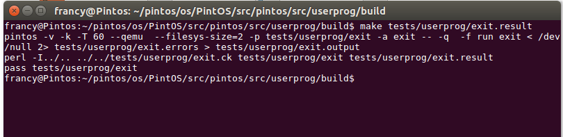


#### Test eseguiti per verificare il funzionamento corretto delle system calls implementate: ####

+ **halt**: il test verifica che il sistema operativo termini l'esecuzione.

+ **exit**: il test verifica che il processo termini correttamente restituendo il codice di uscita al chiamante.
+ write

  + **write-zero**: il test verifica il comportamento della syscall write quando si tenta di scrivere 0 byte in un file. Solitaente la syscall restituisce il numero effettivo di byte scritti o -1 in caso di errore. Nel caso in cui il numero di byte da scrivere sia 0, la write dovrebbe restituire 0 senza scrivere effettivamente nulla nel file.
  + **write-stdin**: tenta di scrivere su un file descriptor associato all'input standard (fd 0) della console (stdin).
  + **write-bad-fd**: il test cerca di scrivere su file descriptor non validi. L'obiettivo è capire come il sistema operativo gestisce tentativi di scrittura su file descriptor che non sono stati aperti correttamente.
  + **write-normal**: verifica che la syscall write funzioni correttamente quando si cerca di scrivere in un file. Il test utilizza la syscall create per creare un file chiamato "test.txt" con i contenuti dell'array "sample" e apre il file utilizzando la syscall open per scrivere all'interno di esso. Alla fine verifica se il numero di byte scritti è uguale a quelli attesi, altrimenti il test fallisce.
  + **write-bad-ptr**: Questo test verifica il comportamento della syscall write quando si tenta di scrivere su file descriptor (fd) non validi. Il test esegue una serie di chiamate a write con diversi file descriptor, alcuni dei quali sono chiaramente non validi.
  + **write-boundary**: cerca di scrivere dati che si estendono su due pagine nello spazio degli indirizzi virtuali. Il test utilizza la funzione `copy_string_across_boundary` per ottenere un puntatore a una stringa che attraversa il confine di pagina virtuale. Questo test è importante per testare il comportamento della write quando i dati si estendono su più pagine.

+ open

  + **open-bad-ptr**: il test verifica che venga gestita correttamente una situazione in cui viene passato un puntatore non valido alla chiamata di sistema open.
  + **open-boundary**: questo test verifica il corretto comportamento nell'apertura di un file manipolato attraverso un confine di memoria.
  + **open-empty**: il test verifica il comportamento corretto nell'apertura di un file vuoto.
  + **open-missing**: Il test verifica il comportamento corretto nell'apertura di un file non esistente.
  + **open-normal**: questo test fa una chiamata a `check_expected` con argomento una lista di stringhe. Le righe seguenti, fino a EOF, sono trattate come parte di questa stringa. Le istruzioni successive sono molto semplici e rappresentano una sequenza in due fasi: "(open-normal) begin" e "(open-normal) end". open-normal: exit(0) è un'annotazione che indica che quando il test raggiunge lo stato "open-normal", dovrebbe terminare con un codice di uscita 0.
  + **open-null**: Il test è progettato per verificare il comportamento dell'applicazione nell'apertura di un file nullo.
  + **open-twice**: Il test è progettato per testare il comportamento di un file quando si tenta di aprirlo più volte.

+ close
 
  + **close-bad-fd**: Il primo blocco testa una situazione in cui l'operazione di chiusura ha successo (exit(0)), mentre il secondo blocco simula un caso in cui la chiusura del file descriptor fallisce (exit(-1)).
  + **close-normal**: questo test fa una chiamata a `check_expected` con argomento una lista di stringhe. Le righe seguenti, fino a EOF, sono trattate come parte di questa stringa. Queste istruzioni rappresentano una sequenza di operazioni che coinvolgono l'apertura e la chiusura di un file chiamato "sample.txt". Nella riga "close-normal: exit(0)" si indica che quando il test raggiunge lo stato "close-normal", dovrebbe terminare con un codice di uscita 0.
  + **close-stdin**: testa l'operazione di chiusura del file descriptor stdin.
  + **close-stdout**: testa l'operazione di chiusura del file descriptor stdout.
  + **close-twice**: verifica la gestione della chiusura ripetuta di un file (sample.txt) nel contesto di un file descriptor specifico (close-twice). Inizialmente, si apre il file sample.txt, lo si chiude una volta e poi si tenta di chiuderlo nuovamente. Il test si aspetta che questa sequenza di operazioni termini cosrrettamente (exit code 0).

+ read

  + **read-bad-fd**: il test cerca di leggere da descrittori di file invalidi. La chiamata di sistema read "deve fallire silenziosamente o terminare il processo con il codice di uscita -1". (errore read)
  + **read-bad-ptr**: questo test cerca di leggere da un puntatore di memoria invalido. L'aspettativa è che la chiamata di sistema read con un puntatore di memoria invalido causi la terminazione del processo di test con un codice di uscita -1. (errore read)
  + **read-boundary**: il test verifica se viene gestita correttamente la lettura di dati che attraversano il confine tra due pagine di memoria. (successo read)
  + **read-normal**: il test verifica che si sia in grado di leggere il file "sample.txt" in modo normale e verificare che il contenuto letto corrisponda al campione fornito (sample). Questo test è progettato per verificare la corretta implementazione della lettura di file. (successo read)
  + **read-stdout**: questo test verifica la capacità di poter leggere da uno stream di output (stdout). (successo read)
  + **read-zero**: questo test verifica come viene gestita una lettura di 0 byte. L'aspettativa è che una lettura di 0 byte restituisca 0 senza leggere effettivamente nulla dal file, e che il buffer non non venga modificato. (successo read)

+ create

  + **create-bad-ptr**: questo test verifica che venga gestita correttamente la creazione di processi con "cattivi" puntatori o indirizzi non validi, terminando il processo di test con un codice di uscita specifico in caso di errore. (errore create)
  + **create-bound**: il test verifica che venga gestita correttamente l'apertura di file quando i loro nomi attraversano i confini di pagina. (successo create)
  + **create-empty**: questo test verifica come viene gestita la creazione di un file quando viene passata una stringa vuota come nome. (errore create)
  + **create-exists**: la creazione di un file con un nome già esistente dovrebbe fallire. Questo test verifica che venga gestita correttamente questa situazione. (errore create)
  + **create-long**: la creazione di un file con un nome così lungo dovrebbe fallire, questo test verifica come viene gestita tale situazione. (errore create)
  + **create-null**: il test tenta di creare un file con un puntatore nullo. (errore create)
  + **create-normal**: questo test serve a verificare la capacità di creare file ordinari e vuoti. (successo create)


Test superati delle syscall implementate (comando `make check`)
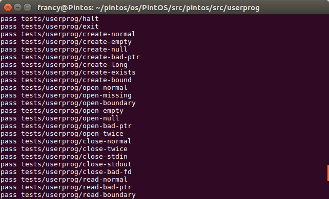

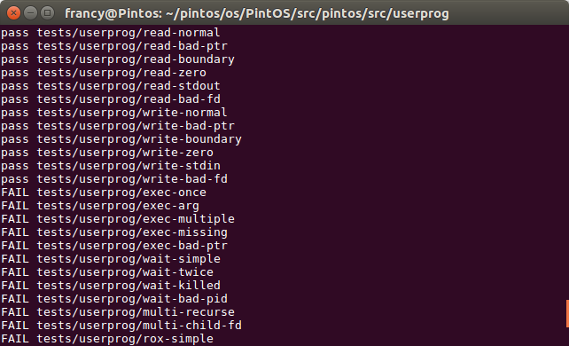


## Funzionamento di una chiamata ad una syscall in Pintos ##

In Pintos, il funzionamento di una chiamata di sistema (syscall) è gestito attraverso una serie di passaggi:

1. **Interrupt:**
   - Quando un programma utente esegue un'istruzione che richiede un'operazione di sistema (come la lettura da un file o la scrittura su disco), si verifica un interrupt hardware o software.

2. **Controllo nell'exception handler:**
   - Una volta avviato l'interrupt, l'exception handler di Pintos, controlla il tipo di interrupt per determinare se si tratta di una chiamata di sistema.

3. **Switch al Kernel Mode:**
   - Se la chiamata di sistema viene riconosciuta, il sistema operativo passa dalla modalità user alla modalità kernel per eseguire il codice del kernel. Inoltre, viene salvato lo stato corrente della CPU, inclusi registri importanti, nell'area di memoria chiamata stack kernel. Questo è necessario per garantire che il sistema possa riprendere l'esecuzione dal punto in cui è stata interrotta.

4. **Identificazione della Syscall:**
   - Il sistema operativo identifica il tipo specifico di chiamata di sistema richiesta, attraverso un numero di servizio o un codice specifico passato dai registri della CPU.

5. **Esecuzione del codice del kernel:**
   - Il kernel esegue il codice specifico per la chiamata di sistema richiesta.

6. **Restituzione del controllo all'user Mode:**
   - Dopo aver completato l'operazione richiesta, il kernel restituisce il controllo al programma utente, ripristinando la modalità utente. Viene anche ripristinato lo stato della CPU e i registri.

_Esempio di syscall che si muove dallo spazio utente allo spazio kernel in Pintos_
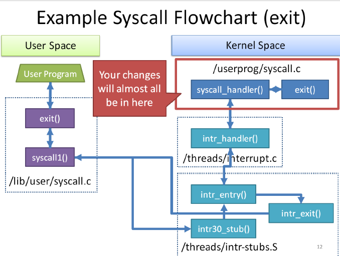


## Modifiche preliminari al codice sorgente per il funzionamento delle system calls scelte da implementare ##

### Modifiche in src/userprog ###

**process.c**

Il file "process.c" in Pintos gestisce la creazione, l'esecuzione e la terminazione dei processi nel sistema operativo. Contiene codice per inizializzare, avviare e gestire le attività dei processi, inclusi il caricamento dei programmi in memoria e la gestione dello stato dei processi.
In particolare:

1) Viene aggiunta una funzione chiamata `get_child()` che serve per ottenere il processo figlio utilizzando l'ID del processo padre.

2) È stata modificata la funzione `process_execute`, aggiungendo un pezzo di codice che estre il nome del processo da parametri riga di comando e lo copia in `process_name`. Inoltre, viene aggiunta anche la gestione della sincronizzazione tra un thread padre e il suo thread figlio grazie all'utilizzo di semafori (Se il thread padre raggiunge questa riga prima che il thread figlio incrementi il valore del semaforo (inizialmente 0), il thread padre si blocchera in attesa del caricamento da parte del thread figlio.) Viene posto anche un costrutto `IF` per verificare se il caricamento è stato completato con successo tramite flag e ritorno errore in caso di caricamento fallito.

3) Viene implementata la funzione `process_wait`, che adesso aspetta la terminazione di un processo figlio specificato da `child_tid`. Se il processo figlio è ancora attivo, il padre si blocca fino a quando il figlio non termina. Una volta che il figlio termina, il padre deve recuperare il valore di ritorno del figlio, rimuovere il figlio dalla lista dei figli e restituire il valore di ritorno del figlio. In caso di errore (il padre non ha figli o il figlio specificato non esiste) ritorno -1.

4) La funzione `process_exit` viene anch'essa modificata, in quanto adesso si acquisisce il lock per garantire l'accesso esclusivo alla risorsa condivisa, per poi scorrere la lista dei figli del thread corrente e deallocare la memoria associata a ciascun figlio (facendo la stessa cosa anche con i file aperti). 

5) La funzione `setup_stack` viene aggiornata per preparare lo spazio di memoria chiamato "stack" per un nuovo processo. Ciò viene realizzato creando una pagina di memoria e organizzando gli argomenti passati al programma in modo che siano facilmente accessibili. Inoltre, vengono sistemati i parametri necessari per avviare il programma all'interno dello stack. Alla fine, la funzione restituisce un valore che indica se l'operazione è riuscita o meno.

**process.h**

Il file process.h in Pintos fornisce le dichiarazioni e le firme delle funzioni utilizzate per la gestione dei processi, inclusa la creazione, l'eliminazione e la gestione dello stato dei processi nel sistema operativo. In particolare:

1) Viene aggiunta la libreria `stdlib.h` 
2) Viene aggiunta struttura _child_ necessaria per tenere traccia dei processi figlio e dei loro valori di ritorno.

### Modifiche in src/threads ###

**thread.c**

Il file `thread.c` gestisce la creazione, la gestione e lo scheduling dei thread nel sistema operativo. Contiene codice per la creazione dei thread, la sincronizzazione tra di essi e la gestione dello scambio della CPU tra i diversi thread in esecuzione. In particolare:

1) Viene modificata la funzione `thread_create` in maniera tale che il thread che viene appena creato sappia dell'esistenza del suo "padre" (con `t->parent = thread_current()`). Allo stesso tempo viene tenuta traccia dei file aperti dal thread e viene aggiunto il thread figlio alla lista dei figli del thread padre, permettendo al padre di tenerne traccia e gestirne l'esecuzione. 

2) Viene modificata la funzione `running_thread`, dove vengono inizializzate le strutture dati necessarie per gestire i thread figli e sincronizzare il thread padre con i suoi figli nel sistema operativo. La lista `children` viene utilizzata per tenere traccia dei thread figli del thread corrente, mentre il semaforo `child_sem` viene utilizzato per sincronizzare il thread padre con i suoi thread figli.

**thread.h**

Vengono aggiunte le seguenti variabili:

* _struct list file_list:_ è la lista dei file aperti dal thread
* _int fd_count:_ tiene traccia del numero totale di file aperti dal thread.
* _struct thread *parent:_ si passa dallo stato di ritorno al thread genitore quando il thread corrente termina l'esecuzione.
* _struct list children:_ è la lista dei processi figlio del thread corrente. 
* _bool production_flag:_ è un flag per segnalare al processo genitore che il processo figlio è stato caricato con successo e quindi proseguire nell'esecuzione.
* _struct semaphore production_sem;_ è un semaforo per far attendere al thread padre che il thread figlio inizi l'esecuzione.
* _struct file *file:_ è un puntatore al file eseguibile associato al thread corrente.
* _struct semaphore child_sem:_ è un semaforo che viene usato quando un thread attende un processo figlio.
* _tid_t waiton_child:_ tiene traccia per quale thread figlio, il thread è in attesa.


### DOCUMENTAZIONE ###

https://piazza.com/class_profile/get_resource/jl28zj99fj24yy/jldagvykoum59l

https://web.stanford.edu/~ouster/cgi-bin/cs140-spring20/pintos/pintos_6.html

https://piazza.com/class_profile/get_resource/itgbdzpqj6417o/iuzt04qzagh40p

https://cs162.org/static/proj/pintos-docs/ 

https://pintosiiith.wordpress.com/

https://www.khoury.northeastern.edu/home/skotthe/classes/cs5600/fall/2016/labs/pintos-setup.html

https://jeason.gitbooks.io/pintos-reference-guide-sysu/content/synchronization.html

http://users.cms.caltech.edu/~donnie/cs124/pintos_4.html

https://uchicago-cs.github.io/mpcs52030/switch.html
